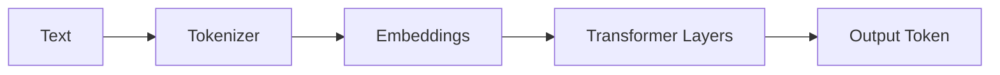
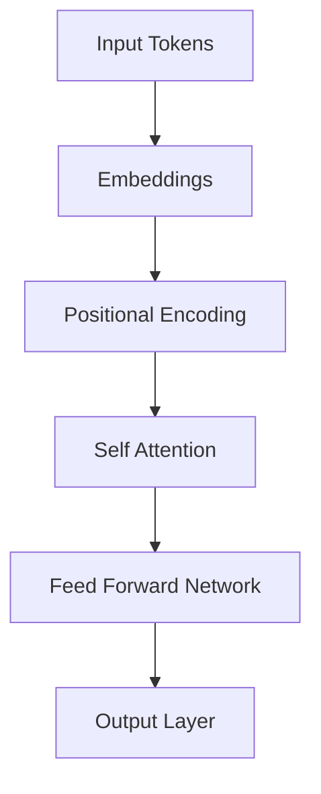
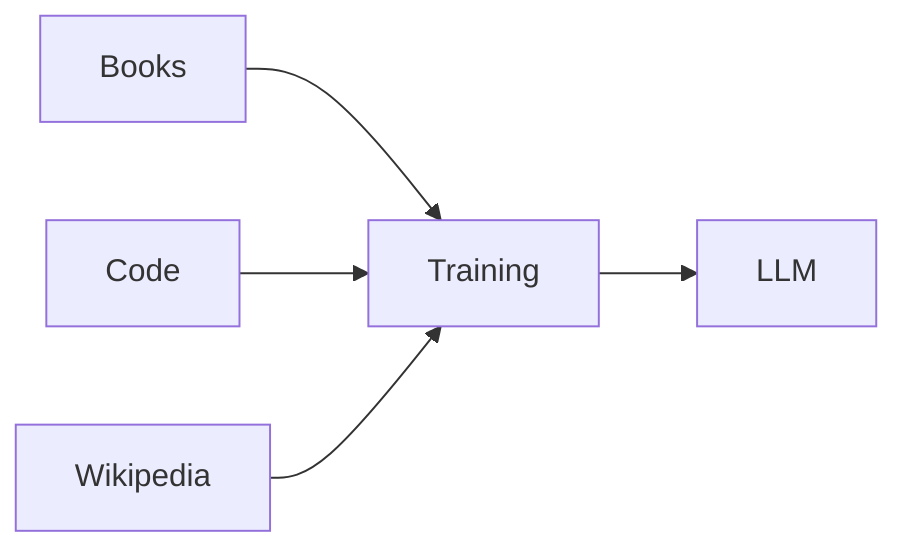
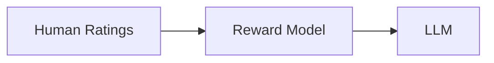
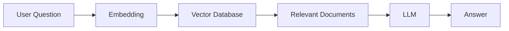
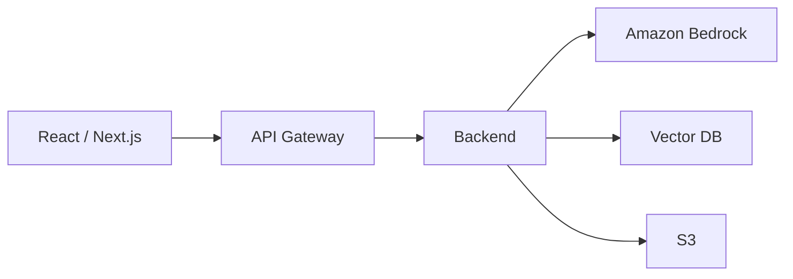

# Large Language Models (LLMs): From Transformers to Production AI

Modern AI assistants such as **ChatGPT**, **Claude**, **Gemini**, **Llama**, and **Amazon Nova** are all powered by **Large Language Models (LLMs)**.

Rather than being programmed with grammar rules or fixed responses, these models learn language by training on massive collections of books, research papers, websites, documentation, and source code.

Today, LLMs power:

- AI Chatbots
- Code Assistants
- Document Search
- Customer Support
- AI Agents
- Enterprise Automation

---

## LLM Architecture



---

## What is an LLM?

A Large Language Model is a neural network trained to **predict the next token**.

Example:

```
Input:

Artificial Intelligence is changing the

Prediction:

world
```

Although the objective is simple, repeating this process over **trillions of tokens** allows the model to learn:

- Grammar
- Reasoning
- Programming
- Mathematics
- World Knowledge
- Conversation
- Problem Solving

---

## Why Transformers Changed AI

Earlier NLP models such as **RNNs** and **LSTMs** processed words sequentially.

```
I
love
AI
```

This caused:

- Slow training
- Poor long-context memory
- Gradient vanishing
- Limited GPU parallelism

Transformers solved these problems using **Self-Attention**, allowing every word to understand every other word simultaneously.

---

## Transformer Pipeline



---

## Tokenization

Computers cannot understand raw text.

Text is first converted into **tokens**.

Example:

```
Artificial Intelligence is amazing.
```

↓

```
Artificial
Intelligence
is
amazing
.
```

Popular tokenizers include:

| Tokenizer | Used By |
|------------|---------|
| BPE | GPT Models |
| SentencePiece | Llama |
| WordPiece | BERT |
| TikToken | OpenAI |

---

## Embeddings

Every token becomes a numerical vector.

Instead of storing

```
Cat
```

the model stores something like

```
[-0.42,
0.15,
0.88,
...
768 values]
```

Words with similar meanings appear close together inside vector space.

---

## Self-Attention

Self-Attention allows every word to decide which other words are important.

Example:

> The trophy didn't fit into the suitcase because **it** was too small.

The model correctly connects

```
it
↓

suitcase
```

instead of

```
it
↓

trophy
```

This is why Transformers understand context so well.

---

## Training an LLM

Training follows one objective:

```
Predict the next token.
```

Pipeline:



Modern training requires:

- Thousands of GPUs
- Distributed Training
- Mixed Precision
- Tensor Parallelism

---

## Fine-Tuning

Instead of retraining the entire model, organizations specialize LLMs using:

- Supervised Fine-Tuning (SFT)
- LoRA
- QLoRA
- Prompt Tuning
- Prefix Tuning

Applications include:

- Medical AI
- Legal AI
- Customer Support
- Coding Assistants

---

## RLHF

Reinforcement Learning from Human Feedback aligns models with human preferences.

Pipeline:



RLHF improves:

- Helpfulness
- Safety
- Honesty
- Instruction Following

---

## Retrieval-Augmented Generation (RAG)

Instead of memorizing everything, modern AI retrieves external knowledge before generating an answer.



### Benefits

- Reduced hallucinations
- Real-time information
- Lower cost than fine-tuning
- Enterprise document search

---

## AI Agents

Modern LLMs can use external tools instead of only generating text.

Examples include:

- Web Search
- SQL Queries
- Python Execution
- REST APIs
- PDF Analysis
- Calendar Management
- Email Automation

This transforms an LLM into an autonomous AI Agent.

---

## Production Architecture



Typical cloud services include:

| Service | Purpose |
|----------|----------|
| Amazon Bedrock | Foundation Models |
| AWS Lambda | Serverless Compute |
| API Gateway | APIs |
| S3 | Document Storage |
| DynamoDB | Metadata |
| CloudFront | CDN |
| CloudWatch | Monitoring |

---

## Evaluating LLMs

Production AI systems are evaluated using more than accuracy.

Common metrics include:

- BLEU
- ROUGE
- BERTScore
- Hallucination Rate
- Latency
- Cost per Request
- Human Evaluation

---

## Future of LLMs

The next generation of AI focuses on:

- Multimodal Models
- AI Agents
- Long Context Windows
- On-device AI
- Mixture of Experts (MoE)
- Retrieval-native Models
- Autonomous Workflows

---

## Key Takeaways

> ✅ LLMs are built on the Transformer architecture.
>
> ✅ Self-Attention enables contextual understanding.
>
> ✅ Fine-Tuning specializes models for specific domains.
>
> ✅ RAG combines LLMs with external knowledge.
>
> ✅ AI Agents extend LLMs with real-world tools.
>
> ✅ Cloud platforms such as Amazon Bedrock simplify production deployment.

---

## Conclusion

Large Language Models have become the foundation of modern Artificial Intelligence. Built on the Transformer architecture and enhanced with techniques such as Fine-Tuning, RLHF, Retrieval-Augmented Generation (RAG), and AI Agents, they power today's most advanced applications—from conversational assistants to enterprise automation platforms.

As models continue to evolve, the future of AI lies in systems that can reason, retrieve information, interact with external tools, and autonomously solve complex real-world problems.