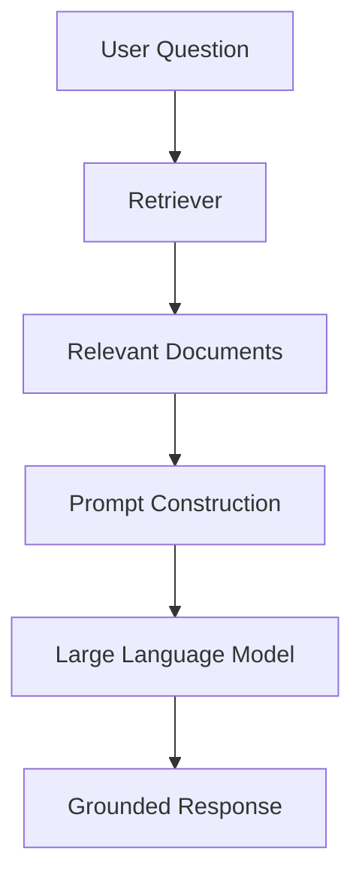
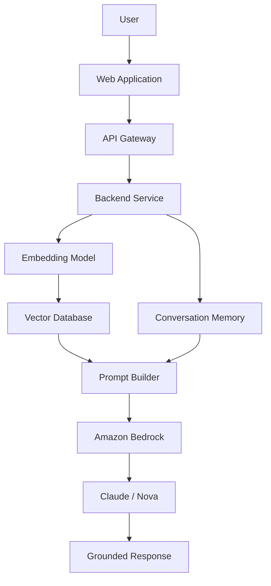

# Building Production-Ready Retrieval-Augmented Generation (RAG) Systems

> **How modern AI applications retrieve trustworthy knowledge instead of hallucinating.**

---

## Introduction

Large Language Models (LLMs) have transformed the way people interact with software. Instead of navigating complex interfaces or writing SQL queries, users can simply ask questions in natural language. Models such as **Claude, GPT, Amazon Nova, Gemini, Llama,** and **Mistral** can summarize documents, generate code, answer questions, translate languages, and assist with software development.

Despite these impressive capabilities, every LLM shares one fundamental limitation:

> **A language model only knows what it learned during training.**

If a user asks:

- *What is RepairDesk's warranty policy?*
- *How many vacation days do employees receive?*
- *Which API endpoint should I use to restore an invoice?*

the model cannot answer reliably unless that information was included in its training data.

Even worse, LLMs often generate responses that sound highly convincing while being completely incorrect. This phenomenon is known as **hallucination**.

For enterprise applications—such as customer support, healthcare, finance, or legal systems—hallucinations are unacceptable. An incorrect answer can lead to financial loss, poor customer experience, and reduced trust in AI systems.

This challenge led to one of the most important architectural patterns in modern AI:

> **Retrieval-Augmented Generation (RAG)**

Instead of relying solely on the model's internal knowledge, a RAG system retrieves relevant information from trusted sources before asking the language model to generate a response. In this architecture, the LLM becomes a **reasoning engine** rather than a **knowledge storage system**.

Today, RAG powers enterprise AI assistants, internal knowledge bases, legal copilots, healthcare assistants, customer support bots, and modern coding assistants.

---

## Why LLMs Alone Are Not Enough

Contrary to popular belief, a Large Language Model is **not a searchable database**.

During pretraining, the model learns statistical relationships between words, phrases, and concepts by processing enormous amounts of text. It does **not** memorize documents that can later be searched like files in a database.

Because of this, LLMs excel at tasks such as:

- Natural language understanding
- Code generation
- Text summarization
- Translation
- Logical reasoning
- Creative writing
- Conversational assistance

However, they struggle with information that changes frequently or exists only within an organization.

Examples include:

- Internal company documentation
- Employee policies
- Live inventory
- Customer-specific information
- Private APIs
- Real-time pricing
- Recently updated manuals

For example, asking:

> *"What products are currently available in today's inventory?"*

is impossible for the model to answer correctly unless it has access to the latest inventory database.

Similarly,

> *"How do I restore a deleted invoice in RepairDesk?"*

cannot be answered reliably unless the model can retrieve the relevant documentation.

This is precisely the problem that Retrieval-Augmented Generation solves.

---

## The Core Idea Behind RAG

Instead of allowing the LLM to answer immediately, a RAG system first searches trusted knowledge sources for information related to the user's question.

The retrieved content is then injected into the prompt, allowing the model to generate a response that is grounded in factual evidence rather than statistical guesses.



Unlike a traditional chatbot, the language model is no longer guessing.

It is:

1. Retrieving
2. Reading
3. Reasoning
4. Answering

This simple architectural change dramatically improves accuracy while reducing hallucinations.

---

## Traditional LLM vs Retrieval-Augmented Generation

| Traditional LLM | Retrieval-Augmented Generation |
|-----------------|--------------------------------|
| Uses only model parameters | Retrieves external knowledge before answering |
| Can hallucinate | Produces grounded responses |
| Knowledge becomes outdated | Always uses the latest documents |
| Cannot access private company data | Works with internal documentation |
| Simple architecture | More accurate and scalable |

Although RAG introduces additional infrastructure, the improvement in answer quality makes it the preferred approach for enterprise AI applications.

---

## A Real-World Example

Imagine a customer asks:

> **"How do I restore a deleted invoice in RepairDesk?"**

### Without RAG

The language model relies entirely on its pretrained knowledge.

It may generate generic accounting advice or even fabricate steps that do not exist within RepairDesk.

### With RAG

Before generating an answer, the system searches trusted knowledge sources such as:

- Product documentation
- User guides
- Support articles
- FAQs
- Internal manuals

The most relevant document is retrieved and added to the prompt.

```
Context:

Invoices can be restored from the Archive section by navigating to...

Question:

How do I restore a deleted invoice?

Answer using ONLY the provided documentation.
```

Because the response is grounded in verified documentation, the likelihood of hallucination is significantly reduced.

---

## Typical Enterprise RAG Architecture

A production-grade RAG system consists of several specialized components working together.



Each component performs a specific responsibility:

| Component | Responsibility |
|------------|----------------|
| Embedding Model | Converts text into vectors |
| Vector Database | Finds semantically similar documents |
| Prompt Builder | Combines retrieved knowledge into a structured prompt |
| LLM | Generates the final response |
| Conversation Memory | Maintains multi-turn interactions |
| API Layer | Securely exposes the assistant to applications |

This modular architecture makes enterprise AI systems easier to scale, maintain, and extend.

---

## Why Companies Prefer RAG Over Fine-Tuning

Organizations often assume they must fine-tune a language model using their internal documentation.

In reality, **Retrieval-Augmented Generation is usually the better first choice.**

Fine-tuning modifies the model's weights to change its behavior. While this is useful for teaching specialized reasoning or response style, it becomes expensive and difficult to maintain when documentation changes frequently.

Every documentation update may require retraining the model.

RAG avoids this problem entirely.

When new documents are added, the system simply generates new embeddings and updates the vector database. The language model immediately gains access to the latest information without requiring any retraining.

For this reason, many enterprise AI teams follow a progression similar to:

```text
Prompt Engineering
        ↓
Retrieval-Augmented Generation
        ↓
Tool Calling & AI Agents
        ↓
Fine-Tuning (Only When Necessary)
```

This approach minimizes infrastructure costs while maximizing flexibility, scalability, and response accuracy.

